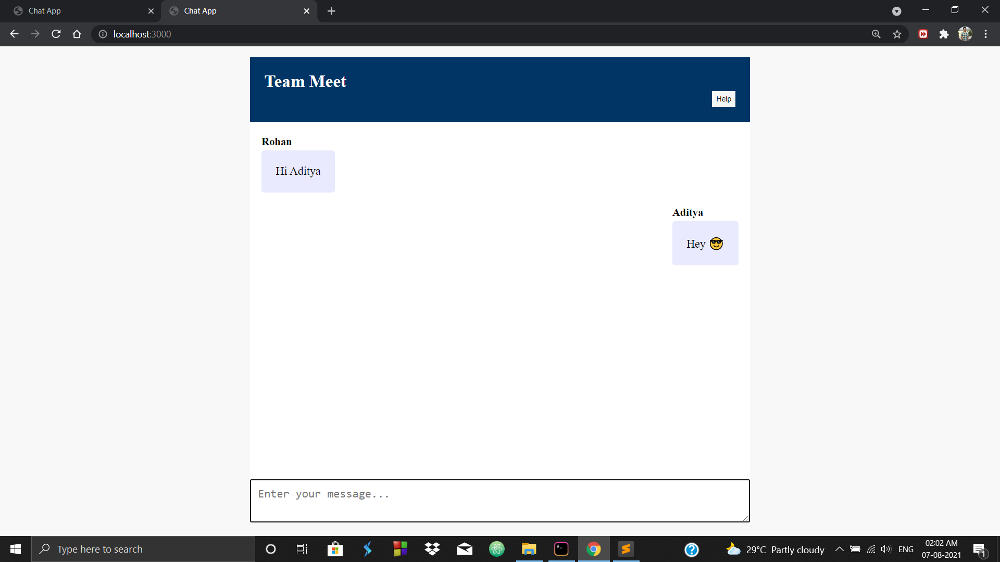
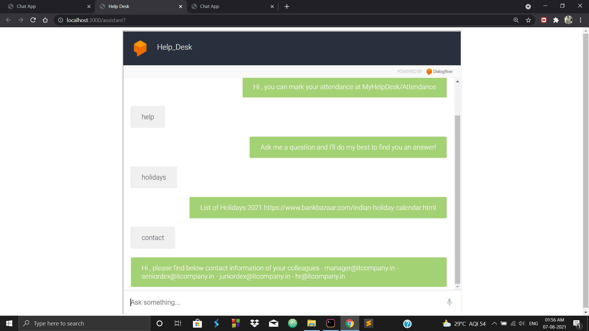

# Team Meet
<h4>✔Team Meet is a Collaborating Platform where different person can come and exchange text with each other.</h4>
<h4>✔It has a personal assistant Help Desk to handle basic day to day queries within an organization.</h4>
<h4>✔To establish a full-duplex connection Socket.io is used.</h4>
<h4>✔The personal assistant is powered by Google's Dialogflow platform.</h4>
 
<h2>👦🏽 User 1</h2>  
 
 
<h2>🧑🏽 User 2</h2>  

 
<h2>💡 Personal Assistant to handle basic day to day queries.</h2>  

